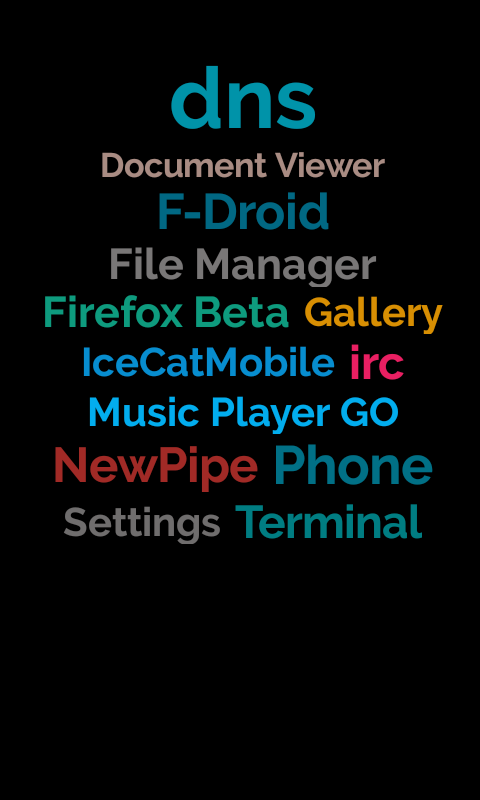

### Prelude

These are the list of some of the apps I use on a daily basis. Most of these are pretty lightweight apps.

***For web browsing***

1. Firefox-beta for Android

2. Firefox release for Android

3. Icecat browser for Android

***For Maintaining Firefox Up-To-Date***

1. FF-updater

***For encrypted traffic exchange on a public network or personal wifi***

1. dnscrypt-proxy(resolves dnssec and secure dns requests to dns servers)

2. Personal DNSfilter for android(for routing all traffic through dnscrypt proxy)

***For YouTube video playback***

1. NewPipe

***Audio player***

1. Music Player Go

***Terminal emulation***

1. Termux

2. Jackpals Android Terminal

***Apps repository***

1. F-Droid

***Document reader***

1. Document viewer(has built in Night mode)

***Launcher I use***

1. Unlauncher

2. Last launcher(Currently using)

***Email reader***

1. Mutt terminal email client(from termux)

2. FairEmail

**Here's a screenshot of my home screen. I'm using Last Launcher as my default launcher**

## Details

Apps like NewPipe, Icecat browser, FF-updater, Music Player Go, Personal DNSfilter, Jackpals Android Terminal, Termux, Document viewer, Unlauncher, Last launcher, FairEmail are all available on the F-Droid repositories. Firefox, I download from their official GitHub repository [release page](https://github.com/mozilla-mobile/fenix/releases). Also there's an app on F-Droid `ffupdater` which checks for Firefox update and downloads them.

**Why two Firefox's?**

Firefox beta has the option to customize the `about:config` portion of the browser just like the Desktop version of Firefox. This is really helpful, and allows you to customize some advanced features like disabling local storage, imposing ssl policies and much more. You can also enable trr mode and esni, which is dns over https, and encrypted sni. And much more advanced features beyond the scope of this little wiki (:

If you're using an Android(Android version > 5.1 ) with root privilege, then you can use my prefs.js to add it to your prefs.js customization. This prefs.js is an improvised version of [pyllyukko-user.js](https://github.com/pyllyukko/user.js) for Firefox Desktop version. 

***The prefs.js***

[prefs.js](https://github.com/samiuljoy/android-recommendations/prefs.js)

To add it you'll first need to fetch the package name for Firefox beta on your phone. To do that, head over to your root terminal and type in. 

`pm list packages firefox | grep beta | sed 's/package://'`

(***Note: sed is a part of busybox binary package, you'll need to have busybox binary preinstalled on your system for sed to work***)

Running the above command will output the name of Firefox beta package on you system. Now to replace it, first place the prefs.js to /your/preferred/location/prefs.js. Then head over to the Firefox data directory, which should be generally under;

`ls /data/data/$(pm list packages firefox | grep beta | sed 's/package://')/files/mozilla/*.default`

Now if you `ls`, you'll see that there's a file called prefs.js. That's the config file of Firefox beta browser. Now to replace it with mine, you can just cat into it, like so 

`cat /your/preferred/location/prefs.js > /data/data/$(pm list packages firefox | grep beta | sed 's/package://')/files/mozilla/*.default/prefs.js`

Restarting Firefox will impose all the new preferences. The reason behind using the normal release version alongside Firefox-beta is because, some sites break under the custom preferences on the Firefox beta version, for eg; GitLab is totally non-functional when using custom preferences on Firefox beta, however, Firefox release version has no feature to edit `about:config` preferences, hence, GitLab loads normally.

**DNSCrypt proxy setup**

Read the [docs](https://github.com/DNSCrypt/dnscrypt-proxy)

To use dnscrypt-proxy in conjunction with Personal dnsfilter app, first download and place dnscrypt-proxy to a executable directory and then execute dnscrypt-proxy and then start personal dnsfilter and change the dns setting to `127.0.0.1` and that's all. To check if you're using dns over https, head over to https://www.cloudflare.com/ssl/encrypted-sni/ or https://1.1.1.1/help and run check browser. Normally it should show dnssec with green check-box, and if you're using Cloudflare dns, the first check-box will be green as well. If you're using Firefox with esni enabled, the last section that says `Encrypted SNI` will also show a green check-box.

It's also possible to execute dnscrypt as a init script. If you're using magisk manager, you can place a init script under `/data/adb/service.d/` chmoding 0700 on the init script.sh, and include the path to dnscrypt binary like so,

`nohup /path/to/dnscrypt/binary/dnscrypt-proxy &`

This will start dnscrypt-proxy on every boot and `nohup &` will allow it to run in the background. All you have to do is start up Personal-dnsfilter before going online.

If you're using a custom rom, you'll need to place your init script under /etc/init.d/ This may vary depending on your OS. Better to google it before copying it over.

**Terminal emulator**

Termux is my go-to terminal emulator. It's so much more than one could wish for. If you're interested in using some of my custom colorschemes, [here](https://github.com/samiuljoy/termux-dark-scheme) is one, and some [more](https://github.com/samiuljoy/customization-for-termux-shell)

### Hopefully you'll find this repository to be helpful (:

## <3 Love and support open-source! <3
